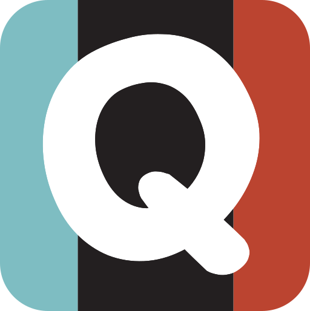

# <div align="center">📋 Qanban</div>

<div align="center">
  
  [](https://html.spec.whatwg.org/)
  [](https://www.w3.org/TR/CSS/)
  [](https://getbootstrap.com/)
  [](LICENSE)

</div>

<p align="center">
  
</p>

<div align="center">
  <h3>Un tablero Kanban elegante, responsivo y fácil de usar para organizar tareas visualmente.</h3>
  <h4><a href="https://github.com/Nekstoreo/Qanban">📊 Demo</a> · <a href="#características">✨ Características</a> · <a href="#instalación">🔧 Instalación</a> · <a href="#uso">📘 Uso</a> · <a href="#roadmap">🛣️ Roadmap</a></h4>
</div>

---

## 📑 Tabla de Contenidos

- [📋 Qanban](#-qanban)
  - [📑 Tabla de Contenidos](#-tabla-de-contenidos)
  - [📁 Estructura del Proyecto](#-estructura-del-proyecto)
  - [✨ Características](#-características)
  - [🎮 Demo](#-demo)
    - [👉 Abre `index.html` en tu navegador para ver la maqueta completa](#-abre-indexhtml-en-tu-navegador-para-ver-la-maqueta-completa)
  - [🔧 Instalación](#-instalación)
  - [🤝 Contribuciones](#-contribuciones)
  - [📄 Licencia](#-licencia)
  - [👤 Autor](#-autor)

## 📁 Estructura del Proyecto

```
Qanban/
├── assets/                 # Recursos estáticos
│   ├── favicon/           # Archivos del favicon
│   │   ├── favicon.ico
│   │   ├── favicon-16x16.png
│   │   ├── favicon-32x32.png
│   │   └── favicon-48x48.png
│   └── logos/             # Logos del proyecto
│       ├── logo.png
│       └── logo.svg
├── docs/                  # Documentación del proyecto
├── .git/                  # Control de versiones
├── .github/               # Configuración de GitHub
├── .gitignore            # Archivos ignorados por Git
├── index.html            # Página principal
├── styles.css            # Estilos CSS
└── README.md             # Este archivo
```

## ✨ Características

<table>
  <tr>
    <td>
      <h3>💡 Interfaz Intuitiva</h3>
      <ul>
        <li>Diseño responsivo con columnas dinámicas</li>
        <li>Sistema visual de prioridades por colores</li>
        <li>Navegación fluida entre columnas</li>
      </ul>
    </td>
    <td>
      <h3>🎨 Experiencia Cuidada</h3>
      <ul>
        <li>Transiciones y efectos hover sutiles</li>
        <li>Contadores de tareas por columna</li>
        <li>Metadatos visuales claros</li>
      </ul>
    </td>
  </tr>
  <tr>
    <td>
      <h3>⚙️ Componentes Inteligentes</h3>
      <ul>
        <li>Tarjetas con insignias de prioridad</li>
        <li>Etiquetas categorizadas por colores</li>
        <li>Indicadores de fecha con iconos</li>
      </ul>
    </td>
    <td>
      <h3>🔄 Preparado para Mejoras</h3>
      <ul>
        <li>Estructura lista para drag & drop</li>
        <li>Componentes para modo oscuro/claro</li>
        <li>Base para almacenamiento local</li>
      </ul>
    </td>
  </tr>
</table>

## 🎮 Demo

<div align="center">

### 👉 Abre `index.html` en tu navegador para ver la maqueta completa

</div>

## 🔧 Instalación

```bash
# Clona el repositorio
git clone https://github.com/Nekstoreo/Qanban.git

# Navega al directorio
cd Qanban

# Abre la aplicación (macOS)
open index.html

# Alternativa para Linux
xdg-open index.html

# Alternativa para Windows
start index.html
```

## 🤝 Contribuciones

<div align="center">
  
  [](https://github.com/Nekstoreo/Qanban/issues)
  [](https://github.com/Nekstoreo/Qanban/pulls)

</div>

¡Las contribuciones son siempre bienvenidas! Si quieres colaborar:

1. 🍴 Haz fork del proyecto
2. 🌿 Crea una rama para tu funcionalidad (`git checkout -b feature/nueva-funcionalidad`)
3. 📝 Realiza tus cambios y haz commit (`git commit -m 'Añadir nueva funcionalidad'`)
4. 📤 Sube tus cambios (`git push origin feature/nueva-funcionalidad`)
5. 🔄 Abre un Pull Request

También puedes ayudar [abriendo issues](https://github.com/Nekstoreo/Qanban/issues) para reportar bugs o sugerir mejoras.

## 📄 Licencia

<div align="center">
  
Este proyecto está bajo la licencia MIT. Consulta el archivo [LICENSE](LICENSE) para más detalles.
  
</div>

## 👤 Autor

<div align="center">
  
  
  **Néstor Gutiérrez**
  
  [](https://linkedin.com/in/nestorgutierrez)
  [](https://github.com/Nekstoreo)
  
</div>

---

<div align="center">
  
  <i>¿Te gusta este proyecto? Dale una ⭐️!</i>
  
</div>
